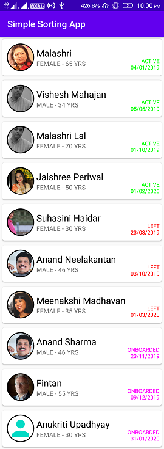

# Simple Sorting App

## Tools or Technology

- Android Studio 4.0
- Kotlin
- MVVM
- Retrofit
- Glide
- CircularImageView
- RecyclerView
- CardView
- JSON
- MutableLiveData
- ArrayList
- Sorting
- Date

## Data that fetched from server

```json
{"list":[{"id":"MnJJA0dbuw","name":"Anand Sharma","img":"https://incablet-tests.s3.ap-south-1.amazonaws.com/conference-content/photos/sponsors/Anand.jpeg","gender":"m","age":46,"date":"23/11/2019","status":"onboarded"},{"id":"MnZmmmbuw","name":"Malashri Lal","img":"https://incablet-tests.s3.ap-south-1.amazonaws.com/conference-content/photos/sponsors/Vishesh.jpg","gender":"f","age":70,"date":"01/10/2019","status":"active"},{"id":"MnZy10dpsq","name":"Suhasini Haidar","img":"https://incablet-tests.s3.ap-south-1.amazonaws.com/conference-content/photos/sponsors/Suhasini.jpg","gender":"f","age":30,"date":"23/03/2019","status":"left"},{"id":"HOnmFt5jA","name":"Vishesh Mahajan","img":"https://incablet-tests.s3.ap-south-1.amazonaws.com/conference-content/photos/sponsors/Vishesh.jpg","gender":"m","age":34,"date":"05/05/2019","status":"active"},{"id":"MnZy10dxyz","name":"Anand Neelakantan","img":"https://incablet-tests.s3.ap-south-1.amazonaws.com/conference-content/photos/sponsors/Anand.jpeg","gender":"m","age":46,"date":"03/10/2019","status":"left"},{"id":"MnZy1JJbuw","name":"Malashri","img":"https://incablet-tests.s3.ap-south-1.amazonaws.com/conference-content/photos/sponsors/Malashri.jpg","gender":"f","age":65,"date":"04/01/2019","status":"active"},{"id":"JKAS10dbuw","name":"Meenakshi Madhavan","img":"https://incablet-tests.s3.ap-south-1.amazonaws.com/conference-content/photos/sponsors/Meenakshi.jpg","gender":"f","age":35,"date":"01/03/2020","status":"left"},{"id":"sOw8c6BOug","name":"Fintan","img":"https://incablet-tests.s3.ap-south-1.amazonaws.com/conference-content/photos/sponsors/Fintan.jpg","gender":"m","age":55,"date":"09/12/2019","status":"onboarded"},{"id":"MnZy10dlll","name":"Jaishree Periwal","img":"https://incablet-tests.s3.ap-south-1.amazonaws.com/conference-content/photos/sponsors/Jaishree.jpg","gender":"f","age":50,"date":"01/02/2020","status":"active"},{"id":"KbN3VELflA","name":"Anukriti Upadhyay","img":"https://incablet-tests.s3.ap-south-1.amazonaws.com/conference-content/photos/sponsors/Anukriti.jpg","gender":"f","age":30,"date":"31/01/2020","status":"onboarded"}]}
```

## Screenshot


